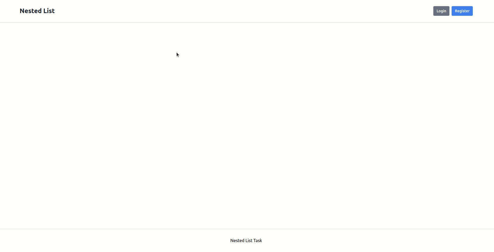

# Product Storage

Web application that allows authorized users to create their own tree structure from sections and subsections.
User cannot see someone else's structural tree. Deleting a section deletes all subsections.

### Prerequisites

1. PHP 7.4 or above
2. Composer 1.10 or above
4. MySQL

### Installation and Setup

1. Clone this repository from Github - `git clone https://github.com/jurispetrovs/nested-list.git`.
2. Create an empty MySQL database.
3. Import the dump file with the following command - `mysql -u user_name -p database_name < sql/db_dump.sql`.
4. Copy the `.env.example` file and rename it `.env`.
5. Set up your `.env` file.
6. Install Composer on the application - `composer install`.
7. Launch the project with command: `php -S localhost:8000`.
8. Open page `localhost:8000` in your browser.